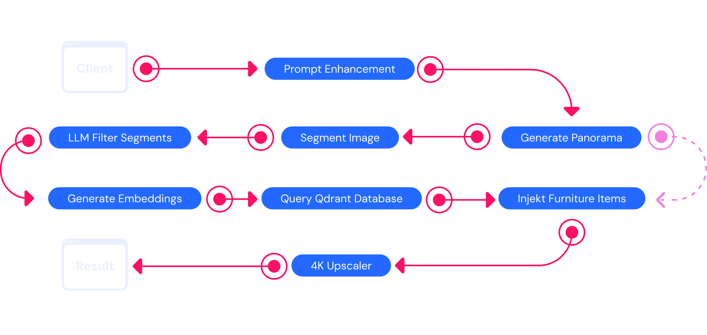

  <a href="https://nextjs.org">
    <picture>
      <source media="(prefers-color-scheme: dark)" srcset="./assets/cover.png">
      
    </picture>
  </a>

  <h1>Interiorly</h1>
  
Design your dream home using natural language — powered by Qdrant.

  
  

## Overview

**Interiorly** showcases the power of Qdrant vector search by combining AI-generated interiors with real-world furniture matching.  
Describe your ideal room in plain English, generate an interactive 360° panorama, and discover matching IKEA products you can actually buy.

Built for the Qdrant Hackathon, the project demonstrates how visual vector search can bridge AI-generated imagery and real shopping experiences.

## How It Works

Interiorly turns a simple text prompt into an interactive, shoppable 360° room through a seamless pipeline:

**1. Describe Your Space**  
You start by describing your dream room in plain English. The system validates the input and uses Mistral 8B (with optional GPT-5) to improve it for a detailed text-to-image model prompt.

**2. Generate the Panorama**  
The prompt gets turned into a high-resolution 360° equirectangular panorama, creating a photorealistic interior scene.

**3. Detect and Segment Furniture**  
Florence-2-Large analyzes the panorama, identifying and isolating individual furniture pieces for further processing.

**4. Find Matching Products**  
Each detected object is embedded with CLIP and compared against the Qdrant vector database of IKEA products to locate visually similar items.

**5. Compose the Final Image**  
SeedDream-4 replaces placeholder objects with real IKEA furniture while preserving the scene’s lighting and perspective.

**6. Deliver in Real Time**  
Progress updates stream to the browser via SSE, and the finished room is rendered in an interactive 360° viewer powered by Pannellum.

This streamlined flow highlights how Qdrant’s vector search, combined with advanced vision and generation models, creates a realistic interior design experience that’s both immersive and directly connected to real products.

## Technology Stack

- **Frontend**: Next.js 14, TypeScript, Tailwind CSS, Pannellum.js (360° viewer)
- **Backend**: Next.js API Routes, PostgreSQL with Drizzle ORM, Cloudflare R2 storage
- **Authentication**: NextAuth.js with session management and rate limiting
- **AI Models**: 
  - `govirtualuk/pegasus` for 360° panorama generation
  - `krthr/clip-embeddings` for visual similarity search
  - Mistral 8B for natural language processing
  - Object detection models for furniture segmentation
- **Vector Database**: Qdrant with 16,000+ IKEA product embeddings
- **Real-time**: Server-Sent Events (SSE) for live progress updates
- **Image Processing**: Sharp.js for segmentation and manipulation
- **Data Pipeline**: Python scripts with Poetry for IKEA catalog processing

## License

MIT License — see [LICENSE](LICENSE) for details.
