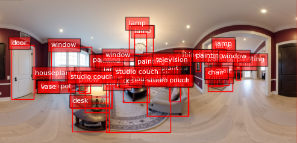
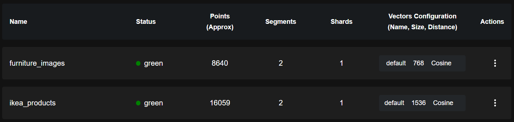

<div align="center">
  <a href="https://nextjs.org">
    <picture>
      <source media="(prefers-color-scheme: dark)" srcset="./assets/cover.png">
      
    </picture>
  </a>

  <h1>Interiorly</h1>
  <p>Design your dream home using natural language — powered by Qdrant.</p>

  <a href="https://interiorly.julianschmidt.cv/">
    
  </a>
  <a href="#license">
    
  </a>
</div>

## Overview

**Interiorly** showcases the power of Qdrant vector search by combining AI-generated interiors with real-world furniture matching. Describe your ideal room in plain English, generate an interactive 360° panorama, and discover matching IKEA products you can actually buy.

Built for the Qdrant Hackathon, the project demonstrates how visual vector search can bridge AI-generated imagery and real shopping experiences.

https://github.com/user-attachments/assets/5d7d4f53-08e0-43c7-ae1a-261d71401466


## How It Works

Interiorly turns a simple text prompt into an interactive, shoppable 360° room through a seamless pipeline:

**1. Describe Your Space**  
You start by describing your dream room in plain text. The system validates the input and uses Pixtral 12B (with optional GPT-5) to improve it for a detailed text-to-image model prompt.

**2. Generate the Panorama**  
The prompt gets turned into a high-resolution 360° equirectangular panorama, creating a photorealistic interior scene.

**3. Detect and Segment Furniture**  
Florence-2-Large analyzes and segments the panorama, identifying and isolating individual furniture pieces for further processing.
<details>
<summary>Example segmentation</summary>

</details>
</details>
<br />

**4. Filter the Furniture**  
The furniture is filtered using GPT-5 to narrow down the list of possible furniture items and remove items that are not available as IKEA products and get structured output with a list of items to proceed with.

> [!IMPORTANT]  
> This step uses GPT-5 since Mistral models had issues with structured output regarding exact id parsing and filtering.

**5. Find Matching Products**  
Each detected object (except filtered) is embedded with CLIP ([clip-vit-large-patch14](https://huggingface.co/openai/clip-vit-large-patch14)) and compared against the Qdrant vector database of IKEA products to locate visually similar items.

**6. Compose the Final Image**  
SeedDream-4 replaces placeholder objects with real IKEA furniture while preserving the scene’s lighting and perspective.

> [!NOTE]
> Before using Seedream-4, this step used Nano Banana for the image editing. Both models come to similar results for this usecase. However, Seedream-4 is faster and cheaper to run thats why it is currently used.

> [!WARNING]
> This is the most unstable part of this project. [Seedream-4](https://replicate.com/bytedance/seedream-4) is not always able to inject the reference images from IKEA directly into the scene. This results in certain furniture items not being injected or not being injected correctly. It may also occur that the aspect ratio and or perspective is not preserved during this step.

**7. Upscale the Image**  
The image is upscaled using a model to improve the quality of the image.

**8. Deliver in Real Time**  
Progress updates stream to the browser via SSE, and the finished room is rendered in an interactive 360° viewer powered by Pannellum.

This streamlined flow highlights how Qdrant’s vector search, combined with advanced vision and generation models, creates a realistic interior design experience that’s both immersive and directly connected to real products.

<details>
<summary>Example Output Datastructure</summary>

```json
[
  {
    "id": "2b7074cc-b532-4259-8a91-a4c8cfa0af55",
    "sceneId": "f0d9774e-847f-42da-b398-4f5906ca9805",
    "role": "assistant",
    "parts": [
      {
        "type": "data-sceneResult",
        "data": {
          "scene": {
            "id": "f0d9774e-847f-42da-b398-4f5906ca9805",
            "title": "Charming Vintage Living Room",
            "prompt": "Charming living room with a fireplace, a sectional sofa, a coffee table, a TV, a sideboard, and a media console.",
            "image": "https://pub-40e0d558605948118bb2c2c19f0cfeaa.r2.dev/panoramas/1758048635604-ecc685b2-c5dd-46a2-86a1-ba26997ae4a0.png",
            "isComplete": true,
            "createdAt": "2025-09-16T18:50:38.067Z"
          },
          "metadata": {
            "processingTime": 128281,
            "steps": [
              "Started room description generation",
              "Generated room description: ### Living Room Description for 360° Panoramic Visualization\n\n#### Room Type and Function\nThe living...",
              "Started panoramic image generation",
              "Generated base panoramic image",
              "Started IKEA furniture integration",
              "Detected 12 objects in the scene",
              "Extracted 12 furniture segments",
              "Filtered to 6 IKEA-compatible furniture items",
              "Found 6 matching IKEA products",
              "IKEA products integrated into scene",
              "Successfully integrated [object Object],[object Object],[object Object],[object Object],[object Object],[object Object] IKEA products",
              "Started image upscaling",
              "Image upscaled successfully",
              "Scene generation completed successfully"
            ],
            "furnitureItemsFound": 12,
            "ikeaProductsUsed": [
              {
                "id": "53acc71a-390e-437d-8f4d-b2458469cb2f",
                "version": 266,
                "score": 0.83912605,
                "payload": {
                  "product_id": "90557886",
                  "product_number": "90557886",
                  "product_name": "GRÖNSTA",
                  "category_name": "Outdoor",
                  "subcategory_name": "Outdoor patio furniture",
                  "description": "Armchair, in/outdoor, white",
                  "price": 95,
                  "currency": "USD",
                  "url": "https://www.ikea.com/us/en/p/groensta-armchair-in-outdoor-white-90557886/",
                  "main_image_url": "https://www.ikea.com/us/en/images/products/groensta-armchair-in-outdoor-white__1243810_pe920959_s5.jpg",
                  "main_image_alt": "GRÖNSTA Armchair, in/outdoor, white",
                  "rating_info": {
                    "rating": 4.7,
                    "review_count": 99,
                    "rating_percentage": 94
                  },
                  "quick_facts": [],
                  "variants": [
                    {
                      "url": "https://www.ikea.com/us/en/p/groensta-armchair-in-outdoor-white-90557886/",
                      "image_url": "https://www.ikea.com/us/en/images/products/groensta-armchair-in-outdoor-white__1243810_pe920959_s5.jpg?f=xu",
                      "description": "",
                      "is_selected": true,
                      "product_id": "groensta-armchair-in-outdoor-white-90557886"
                    },
                    {
                      "url": "https://www.ikea.com/us/en/p/groensta-armchair-in-outdoor-gray-turquoise-20557875/",
                      "image_url": "https://www.ikea.com/us/en/images/products/groensta-armchair-in-outdoor-gray-turquoise__1243805_pe920954_s5.jpg?f=xu",
                      "description": "",
                      "is_selected": false,
                      "product_id": "groensta-armchair-in-outdoor-gray-turquoise-20557875"
                    }
                  ],
                  "clip_image_url": "https://www.ikea.com/us/en/images/products/groensta-armchair-in-outdoor-white__1243810_pe920959_s5.jpg"
                }
              },
              {
                "id": "5e262682-8cae-48ef-95f1-c8135414d12a",
                "version": 170,
                "score": 0.7135848,
                "payload": {
                  "product_id": "60453324",
                  "product_number": "60453324",
                  "product_name": "STENSUND",
                  "category_name": "Kitchen, appliances & supplies",
                  "subcategory_name": "SEKTION Cabinet shelves & drawers",
                  "description": "Glass door, beige, 15x30 \"",
                  "price": 72,
                  "currency": "USD",
                  "url": "https://www.ikea.com/us/en/p/stensund-glass-door-beige-60453324/",
                  "main_image_url": "https://www.ikea.com/us/en/images/products/stensund-glass-door-beige__0944631_pe797369_s5.jpg",
                  "main_image_alt": "STENSUND Glass door, beige, 15x30 \"",
                  "rating_info": {
                    "rating": 5,
                    "review_count": 3,
                    "rating_percentage": 100
                  },
                  "quick_facts": [],
                  "variants": [
                    {
                      "url": "https://www.ikea.com/us/en/p/stensund-glass-door-beige-60453324/",
                      "image_url": "https://www.ikea.com/us/en/images/products/stensund-glass-door-beige__0944631_pe797369_s5.jpg?f=xu",
                      "description": "",
                      "is_selected": true,
                      "product_id": "stensund-glass-door-beige-60453324"
                    },
                    {
                      "url": "https://www.ikea.com/us/en/p/stensund-glass-door-beige-30453325/",
                      "image_url": "https://www.ikea.com/us/en/images/products/stensund-glass-door-beige__0944633_pe797370_s5.jpg?f=xu",
                      "description": "",
                      "is_selected": false,
                      "product_id": "stensund-glass-door-beige-30453325"
                    },
                    {
                      "url": "https://www.ikea.com/us/en/p/stensund-glass-door-beige-90453327/",
                      "image_url": "https://www.ikea.com/us/en/images/products/stensund-glass-door-beige__0944635_pe797371_s5.jpg?f=xu",
                      "description": "",
                      "is_selected": false,
                      "product_id": "stensund-glass-door-beige-90453327"
                    },
                    {
                      "url": "https://www.ikea.com/us/en/p/stensund-glass-door-beige-50453329/",
                      "image_url": "https://www.ikea.com/us/en/images/products/stensund-glass-door-beige__0944637_pe797372_s5.jpg?f=xu",
                      "description": "",
                      "is_selected": false,
                      "product_id": "stensund-glass-door-beige-50453329"
                    },
                    {
                      "url": "https://www.ikea.com/us/en/p/stensund-glass-door-beige-60494145/",
                      "image_url": "https://www.ikea.com/us/en/images/products/stensund-glass-door-beige__0944629_pe797368_s5.jpg?f=xu",
                      "description": "",
                      "is_selected": false,
                      "product_id": "stensund-glass-door-beige-60494145"
                    }
                  ],
                  "clip_image_url": "https://www.ikea.com/us/en/images/products/stensund-glass-door-beige__0944631_pe797369_s5.jpg"
                }
              },
              {
                "id": "691670cc-77f7-4080-9492-961365327383",
                "version": 140,
                "score": 0.84446514,
                "payload": {
                  "product_id": "s49319214",
                  "product_number": "s49319214",
                  "product_name": "FINNALA",
                  "category_name": "Sofas & armchairs",
                  "subcategory_name": "Sofas & sectionals",
                  "description": "Sectional, 4-seat, with chaise/Gunnared beige",
                  "price": 1699,
                  "currency": "USD",
                  "url": "https://www.ikea.com/us/en/p/finnala-sectional-4-seat-with-chaise-gunnared-beige-s49319214/",
                  "main_image_url": "https://www.ikea.com/us/en/images/products/finnala-sectional-4-seat-with-chaise-gunnared-beige__0514363_pe639433_s5.jpg",
                  "main_image_alt": "FINNALA Sectional, 4-seat, with chaise/Gunnared beige",
                  "rating_info": {
                    "rating": 4,
                    "review_count": 6,
                    "rating_percentage": 80
                  },
                  "quick_facts": [
                    "Soft"
                  ],
                  "variants": [
                    {
                      "url": "https://www.ikea.com/us/en/p/finnala-sectional-4-seat-with-chaise-gunnared-beige-s49319214/",
                      "image_url": "https://www.ikea.com/us/en/images/products/finnala-sectional-4-seat-with-chaise-gunnared-beige__0514363_pe639433_s5.jpg?f=xu",
                      "description": "",
                      "is_selected": true,
                      "product_id": "finnala-sectional-4-seat-with-chaise-gunnared-beige-s49319214"
                    },
                    {
                      "url": "https://www.ikea.com/us/en/p/finnala-sectional-4-seat-with-chaise-gunnared-medium-gray-s99319216/",
                      "image_url": "https://www.ikea.com/us/en/images/products/finnala-sectional-4-seat-with-chaise-gunnared-medium-gray__0514365_pe639438_s5.jpg?f=xu",
                      "description": "",
                      "is_selected": false,
                      "product_id": "finnala-sectional-4-seat-with-chaise-gunnared-medium-gray-s99319216"
                    },
                    {
                      "url": "https://www.ikea.com/us/en/p/finnala-sectional-4-seat-with-chaise-gunnared-beige-s99575715/",
                      "image_url": "https://www.ikea.com/us/en/images/products/finnala-sectional-4-seat-with-chaise-gunnared-beige__0514363_pe639433_s5.jpg?f=xu",
                      "description": "",
                      "is_selected": false,
                      "product_id": "finnala-sectional-4-seat-with-chaise-gunnared-beige-s99575715"
                    },
                    {
                      "url": "https://www.ikea.com/us/en/p/finnala-sectional-4-seat-with-chaise-gunnared-medium-gray-s59575717/",
                      "image_url": "https://www.ikea.com/us/en/images/products/finnala-sectional-4-seat-with-chaise-gunnared-medium-gray__0514365_pe639438_s5.jpg?f=xu",
                      "description": "",
                      "is_selected": false,
                      "product_id": "finnala-sectional-4-seat-with-chaise-gunnared-medium-gray-s59575717"
                    },
                    {
                      "url": "https://www.ikea.com/us/en/p/finnala-sectional-4-seat-with-chaise-tallmyra-black-gray-s49575713/",
                      "image_url": "https://www.ikea.com/us/en/images/products/finnala-sectional-4-seat-with-chaise-tallmyra-black-gray__0570235_pe666180_s5.jpg?f=xu",
                      "description": "",
                      "is_selected": false,
                      "product_id": "finnala-sectional-4-seat-with-chaise-tallmyra-black-gray-s49575713"
                    }
                  ],
                  "clip_image_url": "https://www.ikea.com/us/en/images/products/finnala-sectional-4-seat-with-chaise-gunnared-beige__0514363_pe639433_s5.jpg"
                }
              },
              {
                "id": "691670cc-77f7-4080-9492-961365327383",
                "version": 140,
                "score": 0.8463791,
                "payload": {
                  "product_id": "s49319214",
                  "product_number": "s49319214",
                  "product_name": "FINNALA",
                  "category_name": "Sofas & armchairs",
                  "subcategory_name": "Sofas & sectionals",
                  "description": "Sectional, 4-seat, with chaise/Gunnared beige",
                  "price": 1699,
                  "currency": "USD",
                  "url": "https://www.ikea.com/us/en/p/finnala-sectional-4-seat-with-chaise-gunnared-beige-s49319214/",
                  "main_image_url": "https://www.ikea.com/us/en/images/products/finnala-sectional-4-seat-with-chaise-gunnared-beige__0514363_pe639433_s5.jpg",
                  "main_image_alt": "FINNALA Sectional, 4-seat, with chaise/Gunnared beige",
                  "rating_info": {
                    "rating": 4,
                    "review_count": 6,
                    "rating_percentage": 80
                  },
                  "quick_facts": [
                    "Soft"
                  ],
                  "variants": [
                    {
                      "url": "https://www.ikea.com/us/en/p/finnala-sectional-4-seat-with-chaise-gunnared-beige-s49319214/",
                      "image_url": "https://www.ikea.com/us/en/images/products/finnala-sectional-4-seat-with-chaise-gunnared-beige__0514363_pe639433_s5.jpg?f=xu",
                      "description": "",
                      "is_selected": true,
                      "product_id": "finnala-sectional-4-seat-with-chaise-gunnared-beige-s49319214"
                    },
                    {
                      "url": "https://www.ikea.com/us/en/p/finnala-sectional-4-seat-with-chaise-gunnared-medium-gray-s99319216/",
                      "image_url": "https://www.ikea.com/us/en/images/products/finnala-sectional-4-seat-with-chaise-gunnared-medium-gray__0514365_pe639438_s5.jpg?f=xu",
                      "description": "",
                      "is_selected": false,
                      "product_id": "finnala-sectional-4-seat-with-chaise-gunnared-medium-gray-s99319216"
                    },
                    {
                      "url": "https://www.ikea.com/us/en/p/finnala-sectional-4-seat-with-chaise-gunnared-beige-s99575715/",
                      "image_url": "https://www.ikea.com/us/en/images/products/finnala-sectional-4-seat-with-chaise-gunnared-beige__0514363_pe639433_s5.jpg?f=xu",
                      "description": "",
                      "is_selected": false,
                      "product_id": "finnala-sectional-4-seat-with-chaise-gunnared-beige-s99575715"
                    },
                    {
                      "url": "https://www.ikea.com/us/en/p/finnala-sectional-4-seat-with-chaise-gunnared-medium-gray-s59575717/",
                      "image_url": "https://www.ikea.com/us/en/images/products/finnala-sectional-4-seat-with-chaise-gunnared-medium-gray__0514365_pe639438_s5.jpg?f=xu",
                      "description": "",
                      "is_selected": false,
                      "product_id": "finnala-sectional-4-seat-with-chaise-gunnared-medium-gray-s59575717"
                    },
                    {
                      "url": "https://www.ikea.com/us/en/p/finnala-sectional-4-seat-with-chaise-tallmyra-black-gray-s49575713/",
                      "image_url": "https://www.ikea.com/us/en/images/products/finnala-sectional-4-seat-with-chaise-tallmyra-black-gray__0570235_pe666180_s5.jpg?f=xu",
                      "description": "",
                      "is_selected": false,
                      "product_id": "finnala-sectional-4-seat-with-chaise-tallmyra-black-gray-s49575713"
                    }
                  ],
                  "clip_image_url": "https://www.ikea.com/us/en/images/products/finnala-sectional-4-seat-with-chaise-gunnared-beige__0514363_pe639433_s5.jpg"
                }
              },
              {
                "id": "90c27d52-4419-49c9-8890-33ec5edbb7b9",
                "version": 267,
                "score": 0.7519865,
                "payload": {
                  "product_id": "20586552",
                  "product_number": "20586552",
                  "product_name": "STOCKHOLM 2025",
                  "category_name": "Tables & chairs",
                  "subcategory_name": "Tables",
                  "description": "Coffee table, oak veneer glass",
                  "price": 249,
                  "currency": "USD",
                  "url": "https://www.ikea.com/us/en/p/stockholm-2025-coffee-table-oak-veneer-glass-20586552/",
                  "main_image_url": "https://www.ikea.com/us/en/images/products/stockholm-2025-coffee-table-oak-veneer-glass__1362696_pe955296_s5.jpg",
                  "main_image_alt": "STOCKHOLM 2025 Coffee table, oak veneer glass",
                  "rating_info": {
                    "rating": 4.1,
                    "review_count": 15,
                    "rating_percentage": 82
                  },
                  "quick_facts": [],
                  "variants": [],
                  "clip_image_url": "https://www.ikea.com/us/en/images/products/stockholm-2025-coffee-table-oak-veneer-glass__1362696_pe955296_s5.jpg"
                }
              },
              {
                "id": "9e6a7428-5e87-48f4-bfa4-889425ddc26e",
                "version": 81,
                "score": 0.7906162,
                "payload": {
                  "product_id": "s19324995",
                  "product_number": "s19324995",
                  "product_name": "DOCKSTA",
                  "category_name": "Tables & chairs",
                  "subcategory_name": "Dining furniture",
                  "description": "Table, white/white, 40 1/2 \"",
                  "price": 279.99,
                  "currency": "USD",
                  "url": "https://www.ikea.com/us/en/p/docksta-table-white-white-s19324995/",
                  "main_image_url": "https://www.ikea.com/us/en/images/products/docksta-table-white-white__0803262_pe768820_s5.jpg",
                  "main_image_alt": "DOCKSTA Table, white/white, 40 1/2 \"",
                  "rating_info": {
                    "rating": 4.3,
                    "review_count": 450,
                    "rating_percentage": 86
                  },
                  "quick_facts": [],
                  "variants": [
                    {
                      "url": "https://www.ikea.com/us/en/p/docksta-table-white-white-s19324995/",
                      "image_url": "https://www.ikea.com/us/en/images/products/docksta-table-white-white__0803262_pe768820_s5.jpg?f=xu",
                      "description": "",
                      "is_selected": true,
                      "product_id": "docksta-table-white-white-s19324995"
                    },
                    {
                      "url": "https://www.ikea.com/us/en/p/docksta-table-black-black-s99418848/",
                      "image_url": "https://www.ikea.com/us/en/images/products/docksta-table-black-black__1079719_pe857670_s5.jpg?f=xu",
                      "description": "",
                      "is_selected": false,
                      "product_id": "docksta-table-black-black-s99418848"
                    }
                  ],
                  "clip_image_url": "https://www.ikea.com/us/en/images/products/docksta-table-white-white__0803262_pe768820_s5.jpg"
                }
              }
            ],
            "hotspots": [
              {
                "type": "cabinetry",
                "pitch": -34.74000930786133,
                "yaw": -162.0000001490116,
                "text": "cabinetry",
                "URL": ""
              },
              {
                "type": "cabinetry",
                "pitch": -14.22000503540039,
                "yaw": -118.79999923706055,
                "text": "cabinetry",
                "URL": ""
              },
              {
                "type": "chair",
                "pitch": -28.26000213623047,
                "yaw": 38.160011291503906,
                "text": "chair",
                "URL": ""
              },
              {
                "type": "chair",
                "pitch": -14.400001525878906,
                "yaw": 125.10000610351562,
                "text": "chair",
                "URL": ""
              },
              {
                "type": "door",
                "pitch": -3.150005340576172,
                "yaw": 106.20000457763672,
                "text": "door",
                "URL": ""
              },
              {
                "type": "house",
                "pitch": 0.08999450504779816,
                "yaw": 0.0000036656856536865234,
                "text": "house",
                "URL": ""
              },
              {
                "type": "studio couch",
                "pitch": -33.66000747680664,
                "yaw": -7.199989318847656,
                "text": "studio couch",
                "URL": ""
              },
              {
                "type": "studio couch",
                "pitch": -14.22000503540039,
                "yaw": -32.57999801635742,
                "text": "studio couch",
                "URL": ""
              },
              {
                "type": "table",
                "pitch": -27.900005340576172,
                "yaw": -47.51999282836914,
                "text": "table",
                "URL": ""
              },
              {
                "type": "table",
                "pitch": -21.960006713867188,
                "yaw": 26.280006408691406,
                "text": "table",
                "URL": ""
              },
              {
                "type": "window",
                "pitch": 4.319997787475586,
                "yaw": 106.56000518798828,
                "text": "window",
                "URL": ""
              },
              {
                "type": "window",
                "pitch": 7.109994888305664,
                "yaw": -13.67999267578125,
                "text": "window",
                "URL": ""
              }
            ]
          }
        },
        "transient": false
      }
    ],
    "attachments": [],
    "createdAt": "2025-09-16 18:50:38.069"
  }
]
```	

</details>


## Technology Stack

- **Frontend**: Next.js 14, TypeScript, Tailwind CSS, Pannellum.js (360° viewer)
- **Backend**: Next.js API Routes, PostgreSQL with Drizzle ORM, Cloudflare R2 storage
- **Authentication**: NextAuth.js with session management and rate limiting
- **AI Models (Mostly via Replicate)**: 
  - `govirtualuk/pegasus` for 360° panorama generation
  - `krthr/clip-embeddings` for visual similarity search
  - `Pixtral 12B` for natural language processing
  - `OpenAI GPT-5` for natural language processing and structured output
  - Object detection models for furniture segmentation
- **Vector Database**: Qdrant with 16,000+ IKEA product embeddings
- **Real-time**: Server-Sent Events (SSE) for live progress updates
- **Image Processing**: Sharp.js for segmentation and manipulation
- **Data Pipeline**: Python scripts with Poetry for IKEA catalog processing

## Qdrant Database(s)



The application uses two separate Qdrant vector databases for different search capabilities:

- **Text-based search**: Stores product descriptions and metadata as text embeddings for semantic search queries
- **Reverse image search**: Stores product images as visual embeddings for finding similar furniture based on visual similarity

This dual-database approach enables both natural language queries (e.g. "modern white sofa") and visual similarity matching when users upload reference images.

For more information on the Qdrant database, scraping scripts etc., refer to the [Qdrant README](./qdrant/README.md).

## License

MIT License — see [LICENSE](LICENSE) for details.
